# 一个前端开发的PC抽奖程序

### 背景

公司周年庆需要一个能够支撑60000+人的抽奖程序，原本通过找 [网页的开源项目](https://github.com/moshang-xc/lottery) 再定制化实现了效果，并成功运行再周年庆上；但是领导要求要能够在任何地方、任何人只要有一台电脑就能简单方便的定制自己的PC抽奖应用，所有就有了这么一个主题。

### 程序需求

以下是领导从其他地方复制粘贴过来的，就是想实现类似的效果而已。

+ 1、支持数字、字母、手机号、姓名部门+姓名、编号、身份证号等任意组合的抽奖形式。

+ 2、支持名单粘贴功能，从EXCEL、WORD、TXT等任何可以复制的地方复制名单数据内容，粘贴至抽奖软件中作为名单使用，比导入更方便。

+ 3、支持标题、副标题、奖项提示信息、奖品图片等都可以通过拖拽更改位置。
+ 4、支持内定指定中奖者。

+ 5、支持万人抽奖，非常流畅，中奖机率一致，保证公平性。

+ 6、支持中奖不重复，软件自动排除已中奖人员，每人只有一次中奖机会不会出现重复中奖。

+ 7、支持临时追加奖项、补奖等功能支持自定义公司名称、自定义标题。

+ 8、背景图片，音乐等。

+ 9、支持抽奖过程会自动备份中奖名单(不用担心断电没保存中奖名单)。

+ 10、支持任意添加奖项、标题文字奖项名额，自由设置每次抽奖人数设置不同的字体大小和列数。
+ 11、支持空格或回车键抽奖。

+ 12、支持临时增加摇号/抽奖名单，临时删掉不在场人员名单。

### 目前实现的效果

有几个还没实现的

1. 关于人员信息的任意组合抽奖形式，这边只固定了上传模板的表头，需要组合只能通过改excel的内容。
2. 对于临时不在场名单，目前只能通过改excel表再上传才能达到效果。

### 技术选型

由于给的时间不多，能有现成的最好；最终根据定制实现的网页和现在可用js开发PC应用的框架以及最近较新的技术，最终选择下面的开源项目进行集成和修改。

说明：由于之前没看到有electron-vite-vue这个项目，所有自己粗略了用vue3+vite+electron开发了 [抽奖程序](https://github.com/programbao/lottery-electron-vite) , 所以现在就是迁移项目的说明。

github开源项目

+ electron-vite-vue：https://github.com/electron-vite/electron-vite-vue

+ 网页抽奖：https://github.com/moshang-xc/lottery

### 根据仓库的说明运行起来

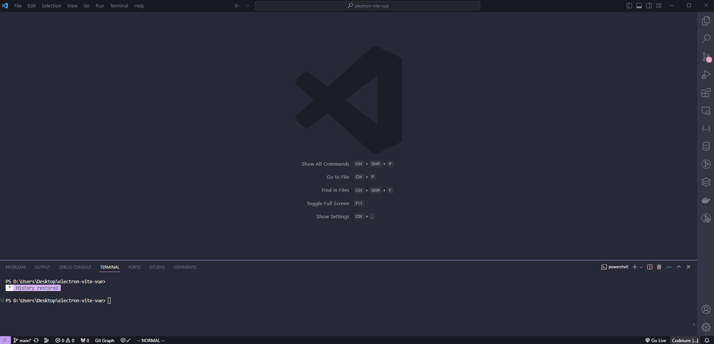

### 修改web端代码并集成到electron

1. 拆分页面

   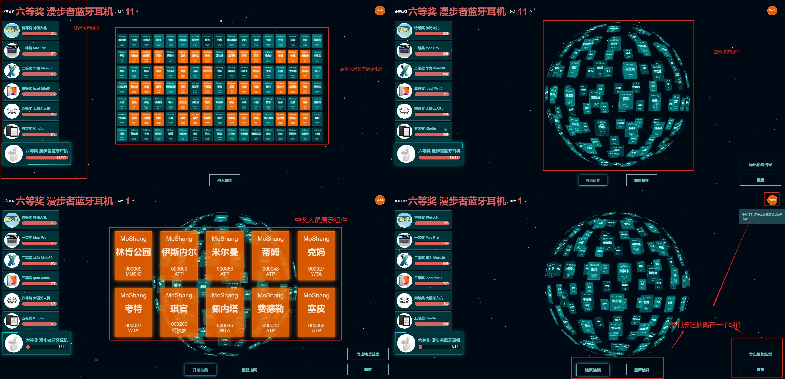

2.补充组件

​	本人根据自己想法加了背景图片、奖品展示、操作按钮区、暂时全部中奖人员名单这几个组件以及另外9个弹窗设置组件。

3.页面目录结构

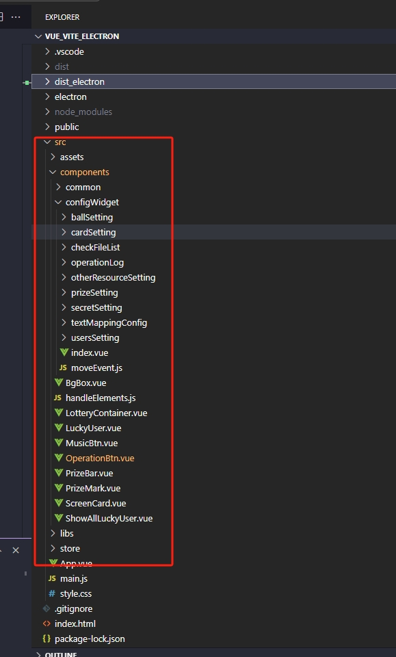

 	4. 最后就是对[开源的网页抽奖项目](https://github.com/moshang-xc/lottery)进行大量的修改了，这里就不详细说了；因为变化太多了，一时半会想不起来。

### 迁移项目

 1. 迁移静态资源

    

​	关于包资源说明，这边因为想做离线的软件，所有固定要使用的包保存到本地了；

 + 引入到index.html中

   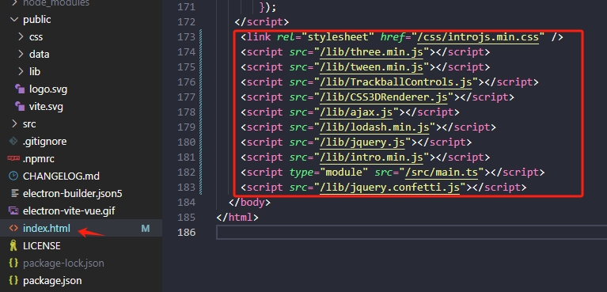

+ 引入图片静态资源

  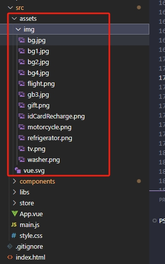

2. 迁移electron代码

   说明：由于我之前写的一版代码是用js而不是ts，如果一下子全改为ts需要一些时间；所有嫌麻烦，我直接引用js文件以及类型报错全部改为any了，后期有时间可以再优化一下。

   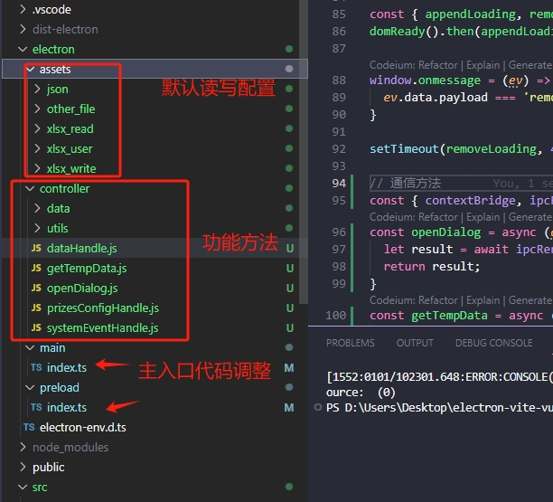

+ 这时候先运行一下，看下有没有问题

  问题1：

​		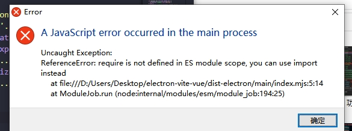

​	这个是因为 我之前的项目一直是用require 引入的；所有要把里面用到require都改为import引入方式；但是在preload.ts里面不能用ESM导入的形式，会报语法错误，要用回require导入。

​	问题二：

​	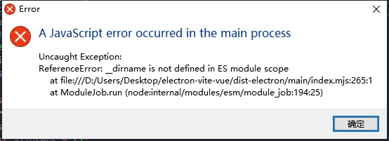

__dirname不是ESM默认的变量；改为

```javascript
import { fileURLToPath } from 'url';
const __dirname = path.dirname(fileURLToPath(import.meta.url))
```


3. 迁移前端代码

   + 目录说明

     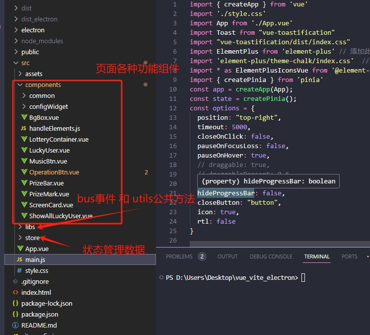

   + 然后一顿复制粘贴，运行，最后报错；

     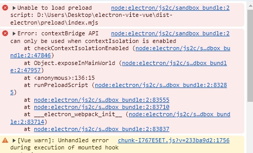

     按提示来改 如下：

     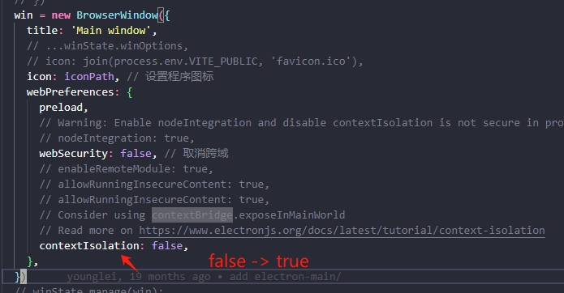

   + 问题2：资源报错

     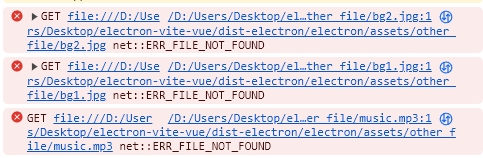

     修复：

     

​				

+ 接下来运行看下是否有问题；

  

​       运行成功

+ 下一步试一下功能

  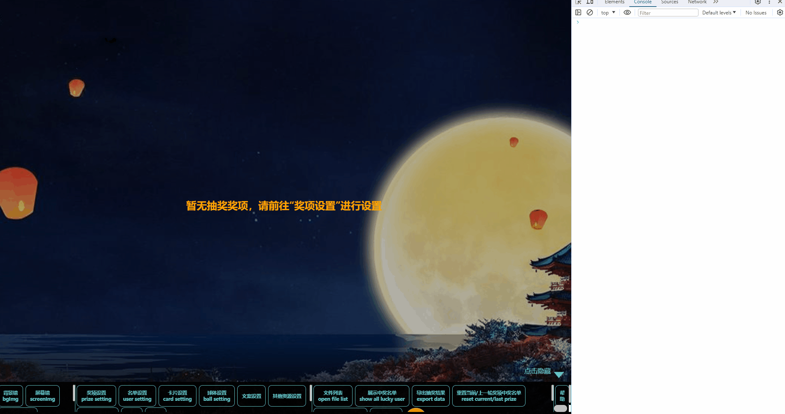

​      功能报错了

+ 看后台错误打印并修复问题

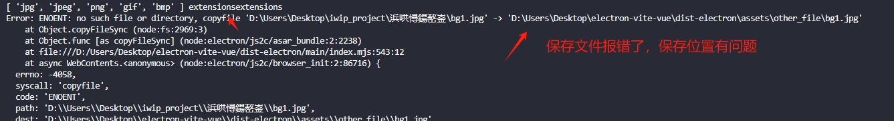

修改：

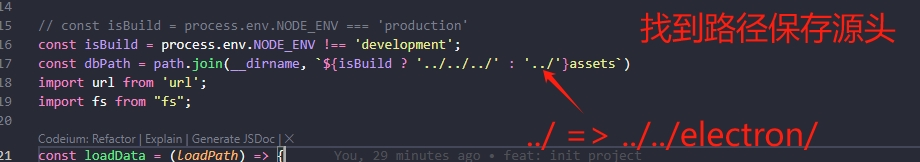


+ 再次尝试功能 - 成功

  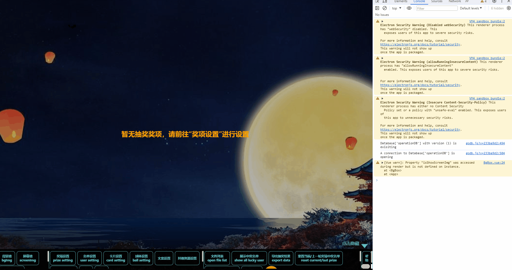

​		

4. 一个流程下来

	<video src="./一个流程-视频.mp4"></video>


### 打包安装运行

1. 运行“npm run build”之后 报错了

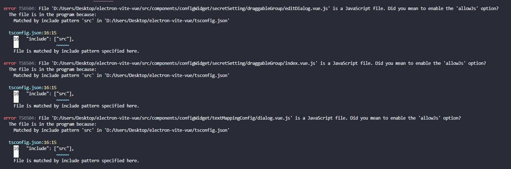

这里说明一下；由于本人懒不行有特意把原本js文件的代码 改为ts；要快速迁移项目 所以直接使用了js；导致打包报错了，所以需要再 tsconfig.json配置一下才行

```json
  "compilerOptions": {
    "allowJs": true // 把这段加上去
  },
```

2. 图标和应用名称错误

   ```javascript
   default Electron icon is used  reason=application icon is not set
   building block map  blockMapFile=release\28.0.0\YourAppName-Windows-28.0.0-Setup.exe.blockmap
   ```

   找到打包的配置文件(electron-builder.json5)进行修改:


   ```javascript
   1. 更改应用名称
   "productName": "抽奖程序",
       
   2. 添加icon图标
    "win": {
       "icon": "electron/controller/data/img/lottery_icon.ico", // ico保存的位置
     },
     "nsi
   ```

3. 打包后运行；资源路径报错了

   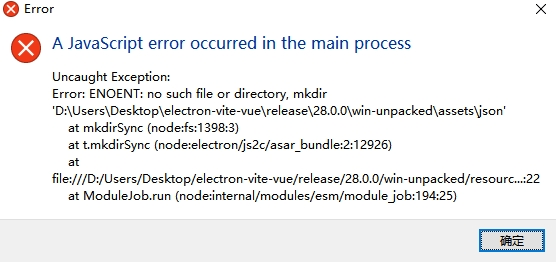


由于上面的原因，需要把程序读写的文件目录暴露出来；

```javascript
1. 在构建配置中加入如下配置，将应用要读写的文件目录暴露出来
"extraResources": [
      {
        "from": "electron/assets",
        "to": "assets"
      }
    ],
```

剩下的就是要重新调整打包后的代码路径了，保证能够找到读写路径；

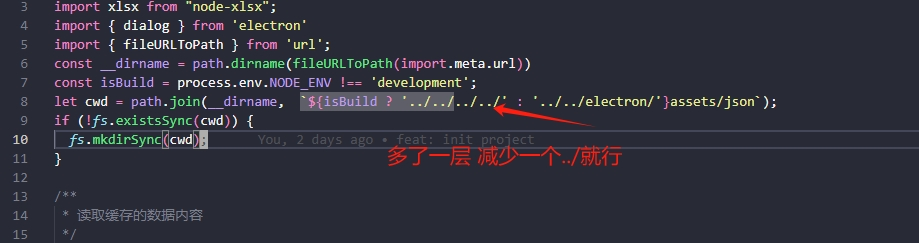


最后打包成功，运行项目


总结：主打的要快速实现，所有这个离线pc抽奖程序还有很多问题，希望大家多多包容；

最后附上github地址：https://github.com/programbao/lottery-electron-vite-vue
欢迎大家使用
